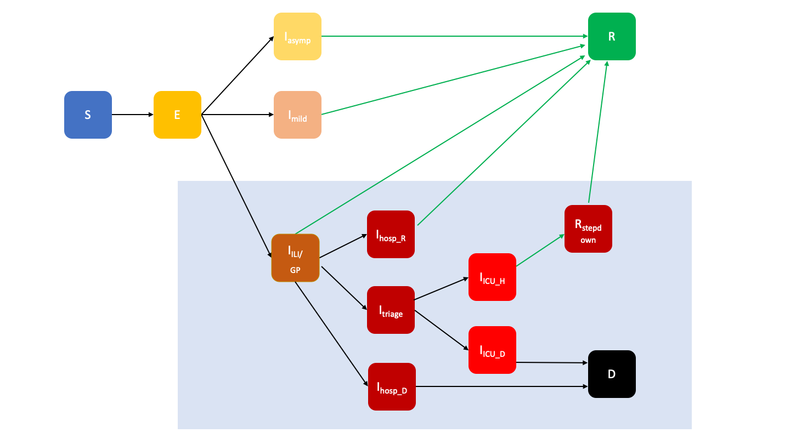

```{r, include = FALSE}
knitr::opts_chunk$set(
  collapse = TRUE,
  comment = "#>"
)
```

# Overview of the structure of the SIRCOVID model

`sircovid` implements a state-space model (also known as a compartmental model) for the transmission of COVID-19 in the UK, starting from 2020-Jan-01. The model, at its core, is an [SEIR model](https://en.wikipedia.org/wiki/Compartmental_models_in_epidemiology#The_SEIR_model). On top of this we have added age structure, hospitalisation pathways, seroprevalence testing and a parallel epidemic in carehomes.

{ width = 10cm}

An overview of this diagram is given below. However, the model is still being actively updated, and those interested in using it are encouraged to review the current version in `inst/odin/carehomes.R` and associated publications.

Individuals are initially susceptible ($S$) in age groups $i$, typically in 17 five year bands up to 80+. Two additional bands are used to separately model care-home workers, and care-home residents. Individuals are infected (into $E$) with rate $\lambda^i(t)$ which is calculated from age-specific mixing of infected $I$ individuals. Individuals may be asymptomatic $I_A$, develop mild symptoms $I_M$ or influenza-like illness (ILI) $I_{\mathrm{ILI}}$. Individuals recover into $R$ - presently we do not model reinfection. Some proportion $p_H$ of those from $I_{\mathrm{ILI}}$ will develop severe symptoms, in which case they may:

- Be admitted into hospital with confirmed COVID-19 with probability $(1-p_{CD})(p_{AC})$.
- Be admitted into hospital, without confirmed COVID-19 with probability $(1-p_{CD})(1 - p_{AC})$.
- No admission to hospital, leading to death in the community $I_{C_D}$, with probability $p_{CD}$.

Of those in general hospital beds, two parallel pathways for confirmed and unconfirmed cases exist, along which individuals may:

- Have their COVID-19 case confirmed ar rate $\gamma_{AC}$.
- Be triaged $I_{T}$ with probability $p_{\mathrm{ICU}}$, before being admitted to an intensive care unit (ICU).
- Remain on the general ward then recover into $R_i$ with probability $(1 - p_{\mathrm{ICU}})(1 - p_{H_D})$.
- Die with probability $(1 - p_{\mathrm{ICU}})p_{H_D}$.

Those triaged into ICU beds may:

- With probability $1 - p_{\mathrm{ICU}_\mathrm{D}}$, recover first in their ICU bed through $I_{ICU_R}$, then a inpatient care step-down period in $R_{\mathrm{ICU}}$, then leave hospital into $R$;
- With probability $p_{\mathrm{ICU}_\mathrm{D}}$, pass through $I_{\mathrm{ICU}_\mathrm{D}}$, and die.

Seroconversion in all exposed individuals is modelled by an independent set of states for pre-seroconversion $R_{\mathrm{pre}}$, and levels which trigger a positive test $R_{\mathrm{pos}}$ or below this giving a negative test $R_{\mathrm{neg}}$.

Transitions between all states use random draws from binomial distributions with set probability $p$ and the number of individuals in the partition $n$.

# Overview of the SIRCOVID code

The epidemiological model is implemented in the [`odin`](https://mrc-ide.github.io/odin/) DSL, and compiled using [`odin.dust`](https://mrc-ide.github.io/odin.dust/). The code can be found in `inst/odin/carehomes.R`.

The model can be run using the [`dust`](https://mrc-ide.github.io/dust/) package interface, given all necessary parameters and initial conditions. Typically however, `sircovid` internally uses `dust` and `mcstate` to provide functions to fit parameters, and simulate the model to create forecasts or counterfactuals.

# Fitting the SIRCOVID model with observational data

The 'comparison function' used by `mcstate` calculates the likelihood of the model state given observed values. This can take daily counts of:

- Number of ICU beds occupied
- Number of general hospital beds occupied
- Number of deaths in hospitals
- Number of deaths in the community
- Number of new hospital admissions
- Number of new cases (pillar 1 data)
- PHE serotype tests in 15-64 year olds (number of seropositive and number tested)
- Pillar 2 testing in over 25s (number of positive tests, number of tests, number of cases)
- Data from the REACT study (number positive and number tested)

At any time-point, groups of this data may be missing `NA`. See `sircovid::carehomes_compare()` for details. This function evolves with the model, and as such we would recommend looking at the code and associated publications for up-to-date details.

Here we will used a simple example with two data-streams to demonstrate how death data from the Office of National Statistics (ONS) and two seroprevalence surveys can be used to fit the model.

## Getting and preparing the data

We will use publicly available data from the Office for National Statistics, licensed under the Open Government Licence:

- Deaths registered https://www.ons.gov.uk/peoplepopulationandcommunity/birthsdeathsandmarriages/deaths/datasets/weeklyprovisionalfiguresondeathsregisteredinenglandandwales
- The COVID-19 infection survey https://www.ons.gov.uk/peoplepopulationandcommunity/healthandsocialcare/conditionsanddiseases/datasets/coronaviruscovid19infectionsurveydata

For simplicity, we will just fit to a single region here (England), but as most of this data is available subdivided into subregions it would also be possible to run independent model fits for each one. The data used here was accessed on 2020-10-12.

### Daily deaths

The daily deaths, where COVID-19 was mentioned on the death certification, can be downloaded above, and found in the 'Covid-19 - Daily occurrences' tab. We will only fit from 2020-Mar-14 onwards. We include a CSV of this information here, the raw data sources can be found in `inst/extdata`. 

```{r}
# Read the data from the CSV
death_data <- read.table("ons_deaths.csv", 
                         sep=",", 
                         header = TRUE, 
                         row.names = NULL, 
                         stringsAsFactors = FALSE)
rmarkdown::paged_table(death_data)
```

### Seroconversion

We can combine this with two data-points from a serosurvey provided by the ONS on 2020-May-04 and 2020-Sep-08:

```{r}
serology <- read.table("ons_serology.csv", 
                       sep=",", 
                       header = TRUE, 
                       row.names = NULL, 
                       stringsAsFactors = FALSE)
serology

# Combine with the death data
i <- match(death_data$date, serology$date)
serology <- serology[i, ]
rownames(serology) <- NULL
data <- cbind(death_data, serology[setdiff(names(serology), "date")])
```

### Cleaning

We will run this analysis over the first wave, covering the start of lockdown until initial easing of restrictions on 2020-May-11.

```{r}
data[,'date'] <- as.Date(data[,'date'], format = "%d/%m/%y")

# Cut out outside date range
data <- data[data$date >= as.Date("2020-03-14"), ]

# Prepare for sircovid. Here only analyse up until restrictions ease
first_wave_data <- data[data$date < as.Date("2020-05-11"), ]
```

We must give the columns their correct names for `sircovid::carehomes_particle_filter()`, adding columns of missing data for any data streams not being fitted:

```{r}
colnames(first_wave_data) <- c("date", "deaths", "npos_15_64", "ntot_15_64")
missing_cols <- c("icu", "hosp", "pillar2_cases", "pillar2_pos", "general", "deaths_comm", "deaths_hosp", "admitted", "new", "new_admitted", 'pillar2_tot', 'pillar2_over25_pos', 'pillar2_over25_tot', 'pillar2_over25_cases', 'react_pos', 'react_tot')
na_col <- as.data.frame(matrix(NA_integer_, 
                               nrow = nrow(first_wave_data),
                               ncol = length(missing_cols)), 
                        row.names = NULL)
colnames(na_col) <- missing_cols
first_wave_data <- cbind(first_wave_data, na_col)
```

Let's also have a look at the full death data-stream over the epidemic so far:

```{r}
plot(data$date, data$deaths, type = 'l', xlab = "Date", ylab = "COVID-19 deaths (England)")
```

## Setting up sircovid with the data

The first step to running `sircovid` is to set up a particle filter `sircovid::carehomes_particle_filter()` which binds the model with the data described above. We must decide:

- The start date of the epidemic, when infections were first seeded. If this is to be sampled/inferred later, this functions as the earliest possible start date. Currently, `sircovid` models the seeding as a single introduction of ten infected individuals in the 15-19 age band.
- How many steps per day to take when simulating the model forward: more steps gives greater resolution at the cost of longer runtimes. We have found four steps a day works well. 

We can use this to process the data into the standard `mcstate` data format as follows, referring to the documentation of `sircovid::carehomes_particle_filter()` to determine the correct column names for the data:

```{r}
steps_per_day <- 4L
pf_data <- sircovid::sircovid_data(first_wave_data, 
                                   start_date = "2020-01-01", 
                                   dt = 1 / steps_per_day)
```

This also converts the dates into a `sircovid_date` for us, which is simply days since 2019-Dec-31 (i.e. `sircovid::sircovid_date("2020-Jan-01") == 1`).

This is actually everything needed to intialise the sircovid particle filter, which can be iterated with different parameter sets to run inference and forecasts. To set this object up, we must also decide how many particles to run (more =~ better but slower; use at least 100); how many threads to parallelise the analysis over, ideally a divisor of the number of particles; and optionally a seed to make analysis reproducible:

```{r}
sircovid_pf <- sircovid::carehomes_particle_filter(pf_data,
                                                   n_particles = 100L,
                                                   n_threads = 1L,
                                                   seed = 1L)
```

We can run this particle filter with a single parameter set to calculate the likelihood of the parameters given the data $\mathcal{L}(\theta|D)$. Here we will look at changing the start date and beta, and how that affects the model likelihood:

```{r}
# Dates are sircovid_date
set.seed(1)
sircovid_pf$run(pars = sircovid::carehomes_parameters(start_date = 15, 
                                                      region = "England", 
                                                      beta_value = 0.05))
sircovid_pf$run(pars = sircovid::carehomes_parameters(start_date = 30, 
                                                      region = "England", 
                                                      beta_value = 0.05))
sircovid_pf$run(pars = sircovid::carehomes_parameters(start_date = 15, 
                                                      region = "England", 
                                                      beta_value = 0.1))
sircovid_pf$run(pars = sircovid::carehomes_parameters(start_date = 30, 
                                                      region = "England", 
                                                      beta_value = 0.05))
```

A start date of 15-Jan-2020 and $\beta = 0.05$ appear to be best in this small grid search. We will now use [pMCMC](https://doi.org/10.1016/j.epidem.2019.100363) to iterate this and calculate full posterior likelihoods for model parameters.

_Note:_ as the particle filter picks up from the last run's random number state, to make runs of the same particle filter reproducible you would need to either set up a new particle filter object, or use the `dust::reset()` function. This is automated in `mcstate` and `sircovid`.

## Setting up the parameter inference

We must now decide on how to treat the parameters in the model. Broadly, we can make three choices for each one:

- Use a fixed value for a parameter.
- Infer the parameter value from the data, giving weak prior information.
- Infer the parameter value from the data, giving strong prior information.

For many of the probabilities of taking different routes through hospitalisation, population size, and rate of contact between age groups we used fixed values. Transmission and epidemic characteristics such as Rt and start date are treated as unknown, with only broad limits on their upper and lower bounds imposed. Parameters for disease severity are taken from [Verity et al 2020](https://doi.org/10.1016/S1473-3099(20)30243-7), but experience with fitting suggests that allowing some variation around these estimates rather than exactly fixed values improves the overall fit -- in this case we infer their values but impose strong priors.

In this example we will first try and estimate the value of Rt before and after national lockdown in March, and the start date of the epidemic (four parameters). All other parameters will remain fixed.

In deciding how to operate parameters, the first thing to do is to look at the odin model under the section `## User defined parameters - default in parentheses:` or run `grep 'user' inst/odin/carehomes.R` to see the names of the model parameters. All of these will automatically be set up, but any can be sampled. Run the following to see the defaults:

```{r}
sircovid::carehomes_parameters(region = "england",
                               start_date = 1) # as sircovid_date i.e. 2020-01-01
```

`start_date` is special in sircovid, and is set from the data in `sircovid::sircovid_data()`, and can be sampled by using the `start_date` name.

The parameters in the `$observation` part of the object can also be sampled, but their use is is in the likelihood `sircovid::carehomes_compare()`, where they are also defined.

### Transforming between model parameters and sampled parameters

If the parameters we are sampling are the same as their name in the odin model nothing special needs to be done. But we are actually free to give sample whatever definition of parameters we wish, as long as we define a transform function relating them to parameters in the model. We use `start_date` directly, and define three linearly-interpolated $\beta$ values `beta_1`, `beta_2` and `beta_3` covering the period of lockdown. This transform must take these `pars` being sampled, and return a suitable `sircovid::carehomes_parameters()` object. This return function, as shown above, is very flexible so most of the parameters can be modified, but the start date and region are mandatory.

The transmission constant $\beta$ in the model is multiplied by the age-specific contact matrix to give the transmission intensity $\lambda$, and is equivalent to $\beta$ in the simple SEIR model. This is a special parameter which can change at specified timepoints, which we typically define using key announcements made by the UK government (though you can use whatever you'd like):

These will be linearly interpolated between the `beta_value` values at every integration timestep by `sircovid::sircovid_parameters_beta()`, but we do only need to call this function ourselves if we would like to make another parameter time varying.

The rates of `progression` in hospital are available individually via `sircovid::carehomes_parameters_progression()` (which are used by default), but can be modified. Severity rates can be obtained from the [markovid](https://github.com/mrc-ide/markovid) package, and loaded with `sircovid::sircovid_parameters_severity()`.

We then must give each parameter to be sampled:

- Its name.
- A maximum and minimum value.
- An initial value.
- Whether it is discrete.
- A prior.

For each of the parameters above we will use improper (flat) priors, the default:

```{r}
start_date_param <-
  mcstate::pmcmc_parameter("start_date",
                           initial = sircovid::sircovid_date("2020-02-08"),
                           min = sircovid::sircovid_date("2020-01-01"),
                           max = sircovid::sircovid_date("2020-03-15"),
                           discrete = TRUE)

beta_date <- c("2020-03-16", "2020-03-23", "2020-03-25")
beta_min <- 0
beta_max <- 1
beta1_param <- mcstate::pmcmc_parameter("beta1", initial = 0.15, min = beta_min, max = beta_max)
beta2_param <- mcstate::pmcmc_parameter("beta2", initial = 0.04, min = beta_min, max = beta_max)
beta3_param <- mcstate::pmcmc_parameter("beta3", initial = 0.03, min = beta_min, max = beta_max)

mcmc_param_list <- list(start_date_param, beta1_param, beta2_param, beta3_param)
```

Care must be taken to ensure the minimum for `start_date` matches that defined in `sircovid::sircovid_data`. The defaults for carehomes contact rates `C_1` and `C_2` should also be modified.

```{r}
# Returns a function which takes pars (which are being sampled).
# Outside function binds beta date when first called
parameter_transform <- function(beta_date) {
  beta_date <- sircovid::sircovid_date(beta_date)
  function(pars) {
    start_date <- pars[["start_date"]]
    beta_value <- unname(pars[c("beta1", "beta2", "beta3")])
    ret <- sircovid::carehomes_parameters(region = "england",
                                          start_date = start_date, 
                                          beta_value = beta_value,
                                          beta_date = beta_date,
                                          C_1 = 3e-7,
                                          C_2 = 3e-7)
    ret
  }
}
```

## MCMC tuning and run

The final element required to build and run the MCMC object is a proposal distribution for each of the above four parameters. Here we will just take a simple diagonal matrix which gives an independent variance for each parameter. The `mcstate` vignette explains how this can be improved by using a previous run.

```{r}
mcmc_proposals <- matrix(0, nrow = length(mcmc_param_list), ncol = length(mcmc_param_list))
diag(mcmc_proposals) <- c(5, 5e-5, 2e-4, 7e-7)

n_steps <- 2e3
n_chains <- 1L
mcmc_params <- mcstate::pmcmc_parameters$new(mcmc_param_list, 
                                             mcmc_proposals, 
                                             parameter_transform(beta_date))
```

We can now run the inference. This will take a long time (~1hr), so increasing the number of threads above can be helpful. For real inference, running for at least 2000 steps on more than one chain is recommended.

```{r mcmc_run, eval=FALSE}

samples <- mcstate::pmcmc(mcmc_params, 
                          sircovid_pf, 
                          n_steps = n_steps,
                          n_chains = n_chains,
                          save_trajectories = TRUE, 
                          progress = TRUE)
saveRDS(samples, file = "samples.rds", version = 2)
```

We can easily plot the modelled deaths versus the data for a single parameter sample from the posterior

```{r include=TRUE, fig.height=5, fig.width=7}
samples <- readRDS("samples.rds")

# extract trajectories that we are fitting
plot_deaths <- function(samples, step) {
  cum_deaths <- samples$trajectories$state[c("deaths_hosp", "deaths_comm"), step, ]
  deaths <- apply(cum_deaths, 1, diff)
  deaths <- cbind(deaths = rowSums(deaths), deaths)
  dx <- sircovid::sircovid_date_as_date(samples$trajectories$step / samples$trajectories$rate)
  # plot against the data
  cols <- c(Total = "#8c8cd9", Hospital = "#cc0044", Community = "#999966")
  plot(data$date, data$deaths, pch = 17, cex = 0.5, xlab = "Date", ylab = "Number of deaths")
  lines(dx[c(-1, -2)], deaths[-1 ,'deaths'], lty = 1, col = cols[["Total"]])
  lines(dx[c(-1, -2)], deaths[-1 ,'deaths_hosp'], lty = 1, col = cols[["Hospital"]])
  lines(dx[c(-1, -2)], deaths[-1 ,'deaths_comm'], lty = 1, col = cols[["Community"]])
  legend("topright", lwd = 1, col = cols, legend = names(cols), bty = "n")
}

plot_deaths(samples, n_steps)
```

This is clearly underestimating the epidemic's peak. We should also have a look at these results to determine whether the MCMC converged, and enough samples were taken:

```{r fig.height=10, fig.width=14}
mcmc <- coda::as.mcmc(cbind(samples$probabilities, samples$pars))
summary(mcmc)
coda::effectiveSize(mcmc)
1 - coda::rejectionRate(mcmc)
plot(mcmc)
```

This is a poor MCMC run. A simple solution is to run more chains for longer, but this is likely to be slow and inefficient. We can try and improve this by setting the proposal distribution to be the same as the observed covariance between samples in this prototype run by setting $\Sigma_P = \left[\frac{2.38^2}{d}\right]\Sigma$, which is achieved with `proposal = alpha * cov(samples$pars)` where $\alpha = \frac{2.38^2}{d}$ and $d$ is the number of parameters (this is [Roberts and Rosenthal's adaptive MCMC algorithm](https://www.jstor.org/stable/27595854)). We can also start the betas from their median value in the previous chain.

```{r tuned_mcmc, eval=FALSE}
beta1_param <- mcstate::pmcmc_parameter("beta1", 
                                        initial = summary(mcmc)$quantiles["beta1", "50%"], 
                                        min = beta_min, max = beta_max)
beta2_param <- mcstate::pmcmc_parameter("beta2", 
                                        initial = summary(mcmc)$quantiles["beta2", "50%"], 
                                        min = beta_min, max = beta_max)
beta3_param <- mcstate::pmcmc_parameter("beta3", 
                                        initial = summary(mcmc)$quantiles["beta3", "50%"], 
                                        min = beta_min, max = beta_max)
mcmc_param_list <- list(start_date_param, beta1_param, beta2_param, beta3_param)

mcmc_params <- mcstate::pmcmc_parameters$new(mcmc_param_list, 
                                             cov(samples$pars), 
                                             parameter_transform(beta_date))

samples_tuned <- mcstate::pmcmc(mcmc_params, 
                                sircovid_pf, 
                                n_steps = n_steps,
                                n_chains = n_chains,
                                save_trajectories = TRUE, 
                                progress = TRUE)
```

Iterating this procedure will produce well-mixed chains which produce samples efficiently, though some manual tweaks to the covariance matrix may be necessary for good mixing. We used a few iterations of this to improve chain mixing, and provide this data pre-calculated. Once a good covariance matrix has been found, you will likely want to run multiple chains for longer, to get a good effective sample size for each parameter, and confirm convergence by calculating the $\hat{R}$ (Gelman-Rubin) statistic.

```{r}
cov_mat <- as.matrix(read.table("cov_proposals.csv", sep = ",", header = F),
                     nrow = length(mcmc_param_list), ncol = length(mcmc_param_list))
print(cov_mat, digits = 2)

mcmc_params <- mcstate::pmcmc_parameters$new(mcmc_param_list, 
                                             cov_mat, 
                                             parameter_transform(beta_date))

n_steps <- 1e4
n_chains <- 4L
```

```{r pre_tuned_mcmc, eval=FALSE}
samples_tuned <- mcstate::pmcmc(mcmc_params, 
                                sircovid_pf, 
                                n_steps = n_steps,
                                n_chains = n_chains,
                                save_trajectories = TRUE, 
                                progress = TRUE)
saveRDS(samples, file = "samples_tuned.rds", version = 2)
```

These chains have a decent effective sample size, and though there is some autocorrelation in them, they appear to have converged to the same optimum.

```{r fig.height=10, fig.width=14}
samples_tuned <- readRDS("samples_tuned.rds")

mcmc_tuned <- coda::as.mcmc(cbind(samples_tuned$probabilities, samples_tuned$pars))
summary(mcmc_tuned)
coda::effectiveSize(mcmc_tuned)
1 - coda::rejectionRate(mcmc_tuned)

# Separate chains for coda
mcmc_list <- vector(mode = "list", length = n_chains)
for (i in 1:n_chains) {
  mcmc_list[[i]] <- coda::as.mcmc(samples_tuned$pars[samples_tuned$chain == i,])
}
mcmc_list <- coda::mcmc.list(mcmc_list)
coda::gelman.diag(mcmc_list)
plot(mcmc_list)
```

We can see the posterior estimates for the epidemic start date (in days into 2020, i.e. a sircovid_date) and the transmission intensity at each time point in `beta_date`. 

Plotting versus the data again:

```{r fig.height=5, fig.width=7}
plot_deaths(samples_tuned, n_steps)
```

This is a better fit to the data than the one above, and captures the overall shape of the epidemic, but still underestimates the peak. Adding more flexibility into the severity parameters, adding more of the available datastreams can help rectify this issue.

## $R_t$ calculations

We can also calculate and plot Rt using the provided helper function:

```{r fig.height=5, fig.width=7}
# Extract the number of susceptibles from the fit
S_partition_index <- grep("^S_", names(samples_tuned$predict$index))
# this gives dimension 19, n_trajectories, n_times
S <- samples_tuned$trajectories$state[S_partition_index, , , drop = FALSE]
n_steps <- dim(samples_tuned$pars)[1]
# Example for the first trajectory
# We must apply the transform function to the parameters i.e. pars = transform(pars)
Rt_estimate <- 
  sircovid::carehomes_Rt(samples_tuned$trajectories$step,
                         S[, n_steps, ],
                         samples_tuned$predict$transform(samples_tuned$pars[1, ]))

plot(first_wave_data$date, 
     Rt_estimate$eff_Rt_all[-1], 
     type='l', xlab = 'Date', ylab = 'Rt')
```

This is only for the final trajectory of the first chain. The `sircovid::carehomes_Rt_trajectories()` function can be used to conveniently calculate this for all of the chains at once.

```{r Rt_all, eval=FALSE}
pars <- lapply(seq_len(nrow(samples_tuned$pars)),
               function(i) samples_tuned$predict$transform(samples_tuned$pars[i, ]))
  
Rt_estimates <- 
  sircovid::carehomes_Rt_trajectories(
    samples_tuned$trajectories$step,
    S,
    pars,
    initial_step_from_parameters = TRUE,
    shared_parameters = FALSE
  )
Rt_estimates$date <- Rt_estimates$step * pars[[1]]$dt
saveRDS(Rt_estimates, "Rt_estimates.rds", version = 2)
```

We can plot the mean and 95% HPD for any of the sampled parameters. Here is a brief example with Rt

```{r fig.height=5, fig.width=7}
Rt_estimates <- readRDS("Rt_estimates.rds")

dates <- sircovid::sircovid_date_as_date(Rt_estimates$date[, 1])
Rt_mean <- apply(Rt_estimates$eff_Rt_all, 1, mean)
Rt_quantiles <- apply(Rt_estimates$eff_Rt_all, 1, quantile, c(0.025, 0.975))

plot(dates[-1], Rt_mean[-1], type = 'l', xlab = "Date", ylab = "Rt")
lines(dates[-1], Rt_quantiles["2.5%", -1], lty = 2, col = "#999999")
lines(dates[-1], Rt_quantiles["97.5%", -1], lty = 2, col = "#999999")
```

# Creating forecasts from a fitted model

Once the model has been fitted, as above, you can continue to run it forwards in time. This simulates runs from the model using samples from the posterior distributions for the fitted parameters. There is no further fitting to data, as it is not available, and parameters will remain the same over the whole time period.

You can run as far forward in time as you would like, though of course we would note that long term predictions are likely to be inaccurate, as parameters are expected to change over time in response to various external factors. Here we will attempt to forecast two weeks into the future, and compare with the observed deaths over that period.

```{r forecasts}
# Choose a number of samples from the MCMC chains to use,
# the amount of burnin to remove, and how long to forecast for
control <- list(n_sample = 100, burnin = 2500, forecast_days = 14)
samples_for_prediction <-
  mcstate::pmcmc_sample(samples_tuned, control$n_sample, control$burnin)
steps_for_prediction <- seq(samples_for_prediction$predict$step,
                            length.out = control$forecast_days + 1L,
                            by = samples_for_prediction$predict$rate)
```

```{r run_forecasts, eval=FALSE}
# Now run predictions, using this sample from the posterior
predicted_trajectories <- mcstate::pmcmc_predict(samples_for_prediction,
                                                 steps_for_prediction,
                                                 prepend_trajectories = TRUE)
predicted_trajectories$date <- predicted_trajectories$step / predicted_trajectories$rate
saveRDS(predicted_trajectories, "forecasts.rds", version = 2)
```

We can plot the sampled trajectories and their forecasts along with the death data that was fitted to. The break between nowcasting and forecasting is shown here by the vertical dashed line.

```{r plot_forecasts, fig.height=7, fig.width=10}
predicted_trajectories <- readRDS("forecasts.rds")

# This has dimension (model partitions, samples, steps) = (49, 20, 73)
# Extract the deaths as before
total_steps <- length(predicted_trajectories$step) - 1L
deaths <- array(dim = c(control$n_sample, total_steps))
for (i in 1:control$n_sample) {
  cum_deaths <- predicted_trajectories$state[c("deaths_hosp", "deaths_comm"), i, ]
  deaths_sample <- rowSums(apply(cum_deaths, 1, diff))
  deaths[i, ] <- deaths_sample
}

# Plot - the first value is removed as it is the earliest start date, not
# the fitted start date
par(mar = c(4.1, 5.1, 0.5, 0.5), las = 1)
mycol <- rgb(140, 140, 217, maxColorValue = 255, alpha = 90)
matplot(predicted_trajectories$date[c(-1, -2)], 
        t(deaths[, -1]), type = "l",
        xlab = "Date", ylab = "Deaths",
        col = mycol, lty = 1, xaxt="n",
        ylim = range(data$deaths))
matpoints(sircovid::as_sircovid_date(data$date)[2:total_steps], 
          data$deaths[2:total_steps], 
          pch = 17, cex = 0.75, col = "#000000")
abline(v = sircovid::as_sircovid_date(max(first_wave_data$date)), 
       lty = 2, col = "#666666")

# Add formatted dates to plot
tics <- seq(1, total_steps, by = 10)
date_format <- format(sircovid::sircovid_date_as_date(predicted_trajectories$date[c(-1, -2)]),
                      "%d-%b")
axis(1, at = predicted_trajectories$date[c(-1, -2)][tics], labels = date_format[tics])
```

If you wish to run difference scenarios, or counterfactuals for periods in the past, you can use the `run` method of the `sircovid::carehomes()` model directly, with your chosen parameters.
