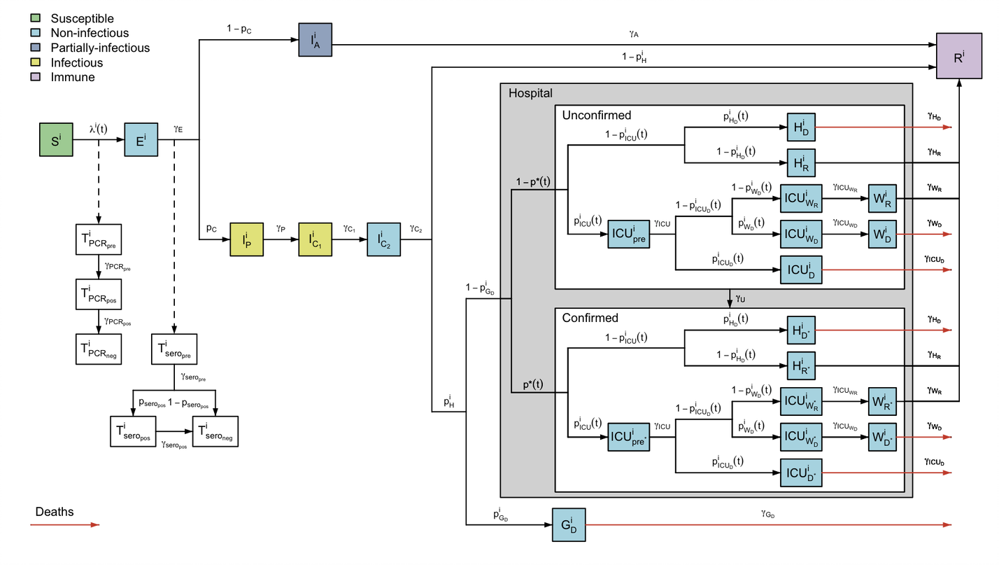

```{r, include = FALSE}
knitr::opts_chunk$set(
  collapse = TRUE,
  comment = "#>"
)
```

# Overview of the SIRCOVID code

The epidemiological model is implemented in the [`odin`](https://mrc-ide.github.io/odin/) DSL, and compiled using [`odin.dust`](https://mrc-ide.github.io/odin.dust/). The code can be found in `inst/odin/carehomes.R`.

The model can be run using the [`dust`](https://mrc-ide.github.io/dust/) package interface, given all necessary parameters and initial conditions. Typically however, `sircovid` internally uses `dust` and `mcstate` to provide functions to fit parameters, and simulate the model to create forecasts or counterfactuals.

# Overview of the structure of the SIRCOVID model

`sircovid` implements a state-space model (also known as a compartmental model) for the transmission of COVID-19 in the UK, starting from 2020-Jan-01. The model, at its core, is an [SEIR model](https://en.wikipedia.org/wiki/Compartmental_models_in_epidemiology#The_SEIR_model). On top of this we have added age structure, hospitalisation pathways, seroprevalence testing and a parallel epidemic in carehomes.



Individuals are initially susceptible ($S$) in age groups $i$, typically in 17 five year bands up to 80+. Two additional bands are used to separately model care-home workers, and care-home residents. Individuals are infected (into $E$) with rate $\lambda^i(t)$ which is calculated from age-specific mixing of infected $I$ individuals. Individuals may be asymptomatic $I_A$, develop mild symptoms $I_M$ or influenza-like illness (ILI) $I_{\mathrm{ILI}}$. Individuals recover into $R$ - presently we do not model reinfection. Some proportion $p_H$ of those from $I_{\mathrm{ILI}}$ will develop severe symptoms, in which case they may:

- Be admitted into hospital with confirmed COVID-19 with probability $(1-p_{CD})(p_{AC})$.
- Be admitted into hospital, without confirmed COVID-19 with probability $(1-p_{CD})(1 - p_{AC})$.
- No admission to hospital, leading to death in the community $I_{C_D}$, with probability $p_{CD}$.

Of those in general hospital beds, two parallel pathways for confirmed and unconfirmed cases exist, along which individuals may:

- Have their COVID-19 case confirmed ar rate $\gamma_{AC}$.
- Recover into $R_i$ probability $p_{H_0}$.
- Die with probability $p_{H_0}$.
- Be triaged $I_{T}$ with probability $p_{\mathrm{ICU}}$, before being admitted to an intensive care unit (ICU).

Those triaged into ICU beds may:

- With probability $1 - p_{\mathrm{ICU}_\mathrm{D}}$, recover first in their ICU bed through $I_{ICU_R}$, then a inpatient care step-down period in $R_{\mathrm{ICU}}$, then leave hospital into $R$; .
- With probability $p_{\mathrm{ICU}_\mathrm{D}}$, pass through $I_{\mathrm{ICU}_\mathrm{D}}$, and die.

Seroconversion in all exposed individuals is modelled by an independent set of states for pre-seroconversion $R_{\mathrm{pre}}$, and levels which trigger a positive test $R_{\mathrm{pos}}$ or below this giving a negative test $R_{\mathrm{neg}}$.

Transitions between all states use random draws from binomial distributions with set probability $p$ and the number of individuals in the partition $n$.

## The 'basic' model

The package also includes a model known as the 'basic' model, which is an older version of the model used in development. It is a subset of the above model states, which doesn't model the states for:

- Seroconversion
- Care-home residents and workers
- Confirmed and unconfirmed cases in the hospital
- Deaths in the community

Only deaths and number of ICU beds occupied can be used to fit the model to data.

This model has its own dust helper objects (`sircovid::basic_compare()`, `sircovid::basic_index()`, `sircovid::basic_initial()`, and `sircovid_parameters()`). This model can be fitted using the same techniques discussed in this vignette, but we do not show the detail here.

# Fitting the SIRCOVID model with observational data

The 'comparison function' used by `mcstate` calculates the likelihood of the model state given observed values. This can take daily counts of:

- Number of ICU beds occupied
- Number of general hospital beds occupied
- Cumulative number of deaths in hospitals
- Cumulative number of deaths in the community
- Number of new hospital admissions
- Number of new cases (pillar 1 data)
- Number of seropositive cases 15-64 yrs old
- Number of people tested between 15-64 yrs old
- Number of pillar 2 testing positive
- Number of pillar 2 tests

At any time-point, any of this data may be missing `NA`. See `sircovid::carehomes_compare()` for details.

Here we will demonstrate how death data from the Office of National Statistics (ONS) and a single seroprevalence survey can be used to fit the model.

## Getting and preparing the data

We will use publicly available data from the Office for National Statistics, licensed under the Open Government Licence:

- Deaths registered https://www.ons.gov.uk/peoplepopulationandcommunity/birthsdeathsandmarriages/deaths/datasets/weeklyprovisionalfiguresondeathsregisteredinenglandandwales
- Deaths in care homes notified to the Care Quality Commission https://www.ons.gov.uk/peoplepopulationandcommunity/birthsdeathsandmarriages/deaths/datasets/numberofdeathsincarehomesnotifiedtothecarequalitycommissionengland 
- The COVID-19 infection survey https://www.ons.gov.uk/peoplepopulationandcommunity/healthandsocialcare/conditionsanddiseases/datasets/coronaviruscovid19infectionsurveydata

For simplicity, we will just fit to a single region here (England), but as most of this data is available subdivided into subregions it would also be possible to run independent model fits for each one. The data used here was accessed on 2020-10-12.

### Daily deaths

The daily deaths, where COVID-19 was mentioned on the death certification, can be downloaded above, and found in the 'Covid-19 - Daily occurrences' tab. We will only fit from 2020-Mar-14 onwards. This is also combined with the ONS data reporting deaths in carehomes. We include a CSV of this information here. 

```{r}
# Read the data from the CSV
death_data <- read.table("ons_deaths.csv", 
                         sep=",", 
                         header = TRUE, 
                         row.names = NULL, 
                         stringsAsFactors = FALSE)
rmarkdown::paged_table(death_data)
```

### Seroconversion

We can combine this with a single data-point from a serosurvey provided by the ONS on 2020-Sep-08:

```{r}
serology <- read.table("ons_serology.csv", 
                       sep=",", 
                       header = TRUE, 
                       row.names = NULL, 
                       stringsAsFactors = FALSE)
serology

i <- match(death_data$date, serology$date)
serology <- serology[i, ]
rownames(serology) <- NULL
data <- cbind(death_data, serology[setdiff(names(serology), "date")])
```

### Cleaning

The last few days of the data is empty, and some of the most recent days have not yet had all deaths reported. Here we simply remove the final week of the data to negate this issue.

```{r}
data_rows <- min(which(is.na(data$England_ons_death_noncarehome))) - 7L
i <- seq_len(data_rows)
data <- data[i,]
data[,'date'] <- as.Date(data[,'date'])
```

We must give the columns their correct names for `sircovid::carehomes_particle_filter()`, adding columns of missing data for any data streams not being fitted:

```{r}
colnames(data) <- c("date", "deaths_comm", "deaths_hosp", "npos_15_64", "ntot_15_64")
missing_cols <- c("icu", "hosp", "pillar2_cases", "pillar2_pos", "general", "deaths", "admitted", "new", "new_admitted")
na_col <- as.data.frame(matrix(NA_integer_, nrow = nrow(data), ncol = length(missing_cols)), 
                        row.names = NULL)
colnames(na_col) <- missing_cols
data <- cbind(data, na_col)
```

Let's now have a look at the two death data-streams over the epidemic so far:

```{r}
plot(data$date, data$deaths_hosp, type = 'l', xlab = "Date", ylab = "COVID-19 deaths")
points(data$date, data$deaths_comm, type = 'l', col='red')
```

## Setting up sircovid with the data

The first step to running `sircovid` is to set up a particle filter `sircovid::carehomes_particle_filter()` which binds the model with the data described above. We must decide:

- The start date of the epidemic, when infections were first seeded. If this is to be sampled/inferred later, this functions as the earliest possible start date. Currently, `sircovid` models the seeding as a single introduction of ten infected individuals in the 15-19 age band.
- How many steps per day to take when simulating the model forward: more steps gives greater resolution at the cost of longer runtimes. We have found four steps a day works well. 

We can use this to process the data into the standard `mcstate` data format as follows, referring to the documentation of `sircovid::carehomes_particle_filter()` to determine the correct column names for the data:

```{r}
steps_per_day <- 4L
pf_data <- sircovid::sircovid_data(data, 
                                   start_date = "2020-01-01", 
                                   dt = 1 / steps_per_day)
```

This also converts the dates into a `sircovid_date` for us, which is simply days since 2019-Dec-31 (i.e. `sircovid::sircovid_date("2020-Jan-01") == 1`).

This is actually everything needed to intialise the sircovid particle filter, which can be iterated with different parameter sets to run inference and forecasts. To set this object up, we must also decide how many particles to run (more =~ better but slower; use at least 100); how many threads to parallelise the analysis over, ideally a divisor of the number of particles; and optionally a seed to make analysis reproducible:

```{r}
sircovid_pf <- sircovid::carehomes_particle_filter(pf_data,
                                                   n_particles = 100L,
                                                   n_threads = 1L,
                                                   seed = 1L)
```

We can run this particle filter with a single parameter set to calculate the likelihood of the parameters given the data $\mathcal{L}(\theta|D)$:

TODO

We will now use [pMCMC](https://doi.org/10.1016/j.epidem.2019.100363) to iterate this and calculate posterior likelihoods for model parameters.

## Setting up the parameter inference

We must now decide on how to treat the parameters in the model. Broadly, we can make three choices for each one:

- Use a fixed value for a parameter.
- Infer the parameter value from the data, giving weak prior information.
- Infer the parameter value from the data, giving strong prior information.

For many of the probabilities of taking different routes through hospitalisation, population size, and rate of contact between age groups we used fixed values. Transmission and epidemic characteristics such as Rt and start date are treated as unknown, with only broad limits on their upper and lower bounds imposed. Parameters for disease severity are taken from [Verity et al 2020](https://doi.org/10.1016/S1473-3099(20)30243-7), but experience with fitting suggests that allowing some variation around these estimates rather than exactly fixed values improves the overall fit -- in this case we infer their values but impose strong priors.

In this example we will first try and estimate the value of Rt before and after national lockdown in March, and the start date of the epidemic (three parameters). All other parameters will remain fixed.

TODO: is there a better way of doing this, for a complex model?
In deciding how to operate parameters, the first thing to do is to look at the odin model under the section '## User defined parameters - default in parentheses:' or run `grep 'user' inst/odin/carehomes.R` to see the names of the model parameters. All of these will automatically be set up, but any can be sampled. Run the following to see the defaults:

```{r}
sircovid::carehomes_parameters(region = "england",
                               start_date = 15) # as sircovid_date i.e. 2020-01-15
```

`start_date` is special in sircovid, and is set from the data in `sircovid::sircovid_data()`, and can be sampled by using the `start_date` name.

The parameters in the `$observation` part of the object can also be sampled, but their use is is in the likelihood `sircovid::carehomes_compare()`, where they are also defined.

### Transforming between model parameters and sampled parameters

If the parameters we are sampling are the same as their name in the odin model nothing special needs to be done. But we are actually free to give sample what parameters we wish, as long as we define a transform function relating them to parameters in the model. We use `start_date` directly, and define three linearly-interpolated $\beta$ values `beta_1`, `beta_2` and `beta_3` covering the period of lockdown. This transform must take these `pars` being sampled, and return a suitable `sircovid::carehomes_parameters()` object. This return function, as shown above, is very flexible so most of the parameters can be modified, but the start date and region are mandatory.

The transmission constant $\beta$ in the model is multiplied by the age-specific contact matrix to give the transmission intensity $\lambda$, and is equivalent to $\beta$ in the simple SEIR model. This is a special parameter which can change at specified timepoints, which we typically define using eight announcements made by the UK government (though you can use whatever you'd like):

These will be linearly interpolated between the `beta_value` values at every integration timestep by `sircovid::sircovid_parameters_beta()`, but we do only need to call this function ourselves if we would like to make another parameter time varying.

The rates of `progression` in hospital are available individually via `sircovid::carehomes_parameters_progression()` (which are used by default), but can be modified. `severity` rates can be obtained from the `markovid` package, and loaded with `sircovid::sircovid_parameters_severity()`.

We then must give each parameter to be sampled:

- Its name.
- A maximum and minimum value.
- An initial value.
- Whether it is discrete.
- A prior.

For each of the parameters above we will use improper (flat) priors, the default:

```{r}
start_date_param <- mcstate::pmcmc_parameter("start_date",
                                             initial = sircovid::sircovid_date("2020-01-24"),
                                             min = sircovid::sircovid_date("2020-01-01"),
                                             max = sircovid::sircovid_date("2020-03-15"),
                                             discrete = TRUE)

beta_date <- c("2020-03-16", "2020-03-23", "2020-03-25")
beta_min <- 0
beta_max <- 1
beta1_param <- mcstate::pmcmc_parameter("beta1", initial = 0.1, min = beta_min, max = beta_max)
beta2_param <- mcstate::pmcmc_parameter("beta2", initial = 0.05, min = beta_min, max = beta_max)
beta3_param <- mcstate::pmcmc_parameter("beta3", initial = 0.028, min = beta_min, max = beta_max)


mcmc_param_list <- list(start_date_param, beta1_param, beta2_param, beta3_param)
```

Care must be taken to ensure the minimum for `start_date` matches that defined in `sircovid::sircovid_data`.

```{r}
# Returns a function which takes pars (which are being sampled).
# Outside function binds beta date when first called
parameter_transform <- function(beta_date) {
  beta_date <- sircovid::sircovid_date(beta_date)
  function(pars) {
    start_date <- pars[["start_date"]]
    beta_value <- unname(pars[c("beta1", "beta2", "beta3")])
    ret <- sircovid::carehomes_parameters(region = "england",
                                          start_date = start_date, 
                                          beta_value = beta_value,
                                          beta_date = beta_date)
    ret
  }
}
```

## MCMC tuning and run

The final element required to build and run the MCMC object is a proposal distribution for each of the above nine parameters. Here we will just take a simple diagonal matrix which gives an independent variance for each parameter. The `mcstate` vignette explains how this can be improved by using a previous run.

```{r}
mcmc_proposals <- matrix(0, nrow = length(mcmc_param_list), ncol = length(mcmc_param_list))
diag(mcmc_proposals) <- c(5.0, 0.01, 0.0025, 0.000625)

mcmc_params <- mcstate::pmcmc_parameters$new(mcmc_param_list, 
                                             mcmc_proposals, 
                                             parameter_transform(beta_date))
```

We can now run the inference. This will take a long time, so increasing the number of threads above can be helpful. For real inference, running for at least 2000 steps on more than one chain is recommended. We also cut the data off at the end of April for demonstration purposes, a full run is shown below.

```{r mcmc_run, eval=FALSE}
# Only run the first couple of months here
first_wave_data <- data[data$date < as.Date("2020-04-30"), ]
pf_first_wave_data <- sircovid::sircovid_data(first_wave_data,
                                              start_date = "2020-01-01", 
                                              dt = 1 / steps_per_day)
sircovid_first_wave_pf <- sircovid::carehomes_particle_filter(pf_first_wave_data,
                                                              n_particles = 100L,
                                                              n_threads = 2L,
                                                              seed = 1L)

samples <- mcstate::pmcmc(mcmc_params, 
                          sircovid_first_wave_pf, 
                          n_steps = 2000L,
                          n_chains = 2L,
                          save_trajectories = TRUE, 
                          progress = TRUE)
saveRDS(samples, file = "samples.Rds")
```

```{r include=FALSE}
samples <- readRDS("samples.Rds")
```

We should now have a look at these results to determine whether the MCMC converged, and enough samples were taken:

```{r fig.height=20, fig.width=28}
mcmc <- coda::as.mcmc(cbind(samples$probabilities, samples$pars))
summary(mcmc)
coda::effectiveSize(mcmc)
plot(mcmc)
```

This is a poor MCMC run. We can try and improve this by setting the proposal distribution to be the same as the observed covariance between samples in this prototype run by setting `proposal = cov(samples$pars)`.

```{r tuned_mcmc, eval=FALSE}
mcmc_params <- mcstate::pmcmc_parameters$new(mcmc_param_list, 
                                             cov(samples$pars), 
                                             parameter_transform(beta_date))

n_steps <- 2000L
n_chains <- 2L
samples_tuned <- mcstate::pmcmc(mcmc_params, 
                                sircovid_first_wave_pf, 
                                n_steps = n_steps,
                                n_chains = n_chains,
                                save_trajectories = TRUE, 
                                progress = TRUE)
saveRDS(samples, file = "samples_tuned.Rds")
```

TODO this didn't work well either

```{r include=FALSE}
samples_tuned <- readRDS("samples_tuned.Rds")
```

```{r fig.height=20, fig.width=28}
mcmc_tuned <- coda::as.mcmc(cbind(samples_tuned$probabilities, samples_tuned$pars))
summary(mcmc_tuned)
coda::effectiveSize(mcmc_tuned)
plot(mcmc_tuned)
```

We can see the posterior estimates for the epidemic start date (in days into 2020, i.e. a sircovid_date) and the transmission intensity at each time point in `beta_date`. We can calculate and plot Rt using the provided helper function:

```{r}
# Extract the number of susceptibles from the fit
S_partition_index <- grep("^S_", names(samples_tuned$predict$index))
# this gives dimension 19, n_trajectories, n_times
S <- samples_tuned$trajectories$state[S_partition_index, , , drop = FALSE]

# Example for the first trajectory
# We must apply the transform function to the parameters i.e. pars = transform(pars)
Rt_estimate <- 
  sircovid::carehomes_Rt(samples_tuned$trajectories$step,
                         S[, n_steps, ],
                         samples_tuned$predict$transform(samples_tuned$pars[1, ]))

plot(first_wave_data$date, 
     Rt_estimate$eff_Rt_all[-1], 
     type='l', xlab = 'Date', ylab = 'Rt')
```

This is only for the final trajectory of the first chain. The `sircovid::carehomes_Rt_trajectories()` function can be used to conveniently calculate this for all of the chains at once.

### Nine parameter fit

To demonstrate an extension of these, we can attempt to model Rt over the course of the epidemic, which will also be informed by the seroprevalence survey taken in September. We now have eight $\beta$ parameters, and the full range of data:

```{r}
# Set up betas
beta1_param <- mcstate::pmcmc_parameter("beta1", initial = 0.1, min = beta_min, max = beta_max)
beta2_param <- mcstate::pmcmc_parameter("beta2", initial = 0.05, min = beta_min, max = beta_max)
beta3_param <- mcstate::pmcmc_parameter("beta3", initial = 0.028, min = beta_min, max = beta_max)
beta4_param <- mcstate::pmcmc_parameter("beta4", initial = 0.019, min = beta_min, max = beta_max)
beta5_param <- mcstate::pmcmc_parameter("beta5", initial = 0.024, min = beta_min, max = beta_max)
beta6_param <- mcstate::pmcmc_parameter("beta6", initial = 0.023, min = beta_min, max = beta_max)
beta7_param <- mcstate::pmcmc_parameter("beta7", initial = 0.023, min = beta_min, max = beta_max)
beta8_param <- mcstate::pmcmc_parameter("beta8", initial = 0.026, min = beta_min, max = beta_max)

mcmc_param_list <- list(start_date_param, beta1, beta2, beta3, beta4, beta5, beta6, beta7, beta8)

# Transform between mcstate and odin model
parameter_transform <- function(pars) {
  start_date <- pars[["start_date"]]
  beta_value <- unname(pars[c("beta1", "beta2", "beta3", "beta4",
                              "beta5", "beta6", "beta7", "beta8")])
  sircovid::carehomes_parameters(region = "england",
                                 start_date = start_date, 
                                 beta_value = beta_value,
                                 beta_date = beta_date)
}

## Actual dates of Rt change 
## 1. 2020-03-16 - PM advises WFH, against non-essential travel etc
## 2. 2020-03-23 - PM announces full lockdown
## 3. 2020-03-25 - lockdown into full effect
## 4. 2020-05-11 - initial easing of lockdown
## 5. 2020-06-15 - non-essential shops can open
## 6. 2020-07-04 - restaurants, pubs etc can open
## 7. 2020-08-01 - "Eat out to help out" scheme starts
## 8. 2020-09-01 - schools re-open
beta_date <- c("2020-03-16", "2020-03-23", "2020-03-25",
               "2020-05-11", "2020-06-15", "2020-07-04",
               "2020-08-01", "2020-09-01")
beta_date <- sircovid::sircovid_date(beta_date)

# MCMC proposals
mcmc_proposals <- matrix(0, nrow = length(mcmc_params), ncol = length(mcmc_params))
diag(mcmc_proposals) <- c(5.0, 0.01, 0.0025, 0.000625, 0.000625, 0.000625, 0.000625, 0.000625, 0.000625)

mcmc_params <- mcstate::pmcmc_parameters$new(mcmc_param_list, 
                                             mcmc_proposals, 
                                             parameter_transform)
```

Now we can run this fit:

```{r mcmc_run_full, eval=FALSE}
samples_full <- mcstate::pmcmc(mcmc_params, 
                               sircovid_pf, # defined earlier 
                               n_steps = 2000L,
                               n_chains = 2L,
                               save_trajectories = TRUE, 
                               progress = TRUE)
saveRDS(samples_full, file = "samples_full.Rds")
```

```{r include=FALSE}
samples_full <- readRDS("samples_full.Rds")
```


# Creating forecasts from a fitted model

```{r}
message("Running forecasts")
samples_predict <-
  mcstate::pmcmc_sample(samples, control$n_sample, control$burnin)
steps_predict <- seq(samples_predict$predict$step,
                     length.out = control$forecast_days + 1L,
                     by = samples_predict$predict$rate)
samples_predict$trajectories <- mcstate::pmcmc_predict(samples_predict, steps_predict,
                                                       prepend_trajectories = TRUE)
samples_predict$trajectories$date <- samples_predict$trajectories$step / 
  samples_predict$trajectories$rate


## Compute incidence trajectories
samples_predict$trajectories <-
  carehomes_ons_incidence(samples_predict$trajectories)

message("Computing Rt")
rt <- calculate_ons_Rt(samples_predict)
```

